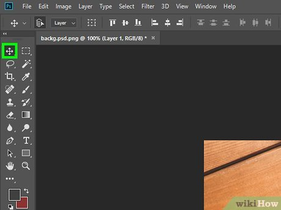

My First Experiences Using Adobe Photoshop

By Riley Johnson

	The first time I booted up Photoshop was shortly after I learned that apart of my college tuition allowed me to apply for access to the adobe suite. I was intrigued as I had always heard of this nice tool for photo editing, but had never explored it myself as I knew it was tied behind a monthly subscription that was pretty costly. As such I had little to no **mental model** ( A type of mental visual preconception of what the object is like and how it should act) of what the tool was actually like other than what I had imagined it was like This tool was used by professionals all over and I had finally been given access to explore it’s potential. After applying and receiving access permissions I booted up the application and was met with the home screen where you can create and view all of your projects. ![ProjectsList] (JournalPics/ProjectsList.png)

	For me it was blank and the one button that stood out from all the rest was the one blue “New File” button. I started up my first project by clicking it and was presented with a plethora of canvas size options. ![CanvasSize] (JournalPics/CanvasSize.png)

	I knew they were pixel dimensions but I had no real concept of their sizes or effects that they would have on the project so I picked the very first suggested option and began plotting what I wanted to try. Immediately upon entering the project space I was given a few tips on the different tools and how they might be used. These included the select, erase, brush, and lasso tools. I clicked through them a little quickly and had a basic idea of what they did but thought that was enough to get started. This had also functioned as a definitive way to update my **mental model** on how the app actually looked. It was confusing with the amount of different options and pages that were just there up front and center. I still was not given any inkling of what most of them did. 

	The first thing I tried to do was open up some files to cut apart and stitch together. I copied in a two photos I found online using CTRL + C and CTRL +V commands and it worked just like how I expected but What I wasn’t used to was their layering system (you can have priorities of which images/assets appear in front of others using the layer hierarchy). I didn’t realise that you could only make changes to the assets on the selected layer (current layer) and I thought I just couldn’t interact with one of my images. It was a little frustrating and I gave up soon after. My goal was to go in and experience the tool to try and make something, but the final result was a failed attempt. I’ve since learned much more about photoshop and its functions but as a new user it was a pain in the butt. There are plenty of tutorials online and many creators to help new users but the app itself is still pretty intimidating for someone without any prior knowledge or experience. 
